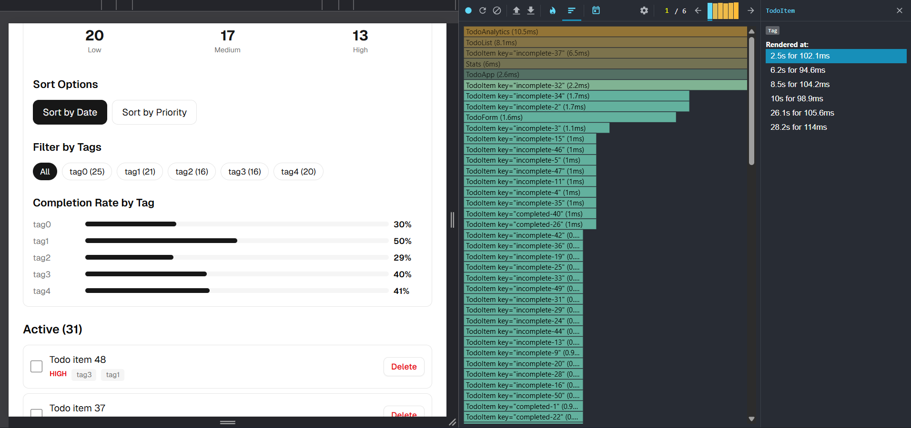
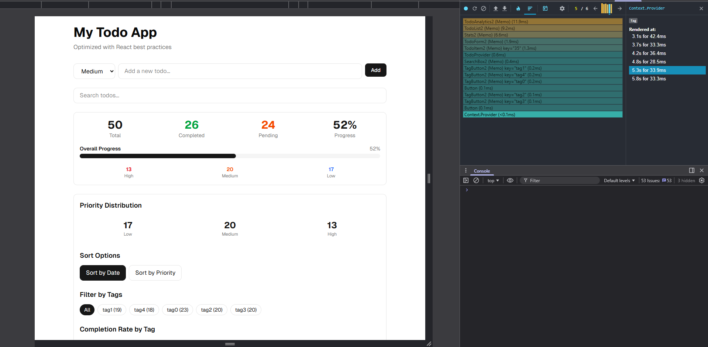

# Todo App Refactoring Lab

A React performance optimization exercise that transforms a legacy Todo application into a high-performance, maintainable codebase using modern React patterns.

## Overview

This project started as a legacy React app with several anti-patterns that caused performance issues. The goal was to identify these problems, understand why they're harmful, and apply modern React best practices to fix them.

## What Was Wrong (Anti-Patterns Found)

### 1. Class Components Instead of Function Components

The original app used class components like this:

```tsx
class TodoApp extends React.Component {
  constructor(props) {
    super(props)
    this.state = { todos: [], searchQuery: '' }
  }
  render() { ... }
}
```

**Why it's a problem:** Class components can't use hooks like `useMemo`, `useCallback`, and can't be wrapped with `React.memo` as easily. This makes performance optimization much harder.

### 2. Everything Re-renders When Anything Changes

When you typed ONE letter in the search box, the entire app would re-render - all 50+ todo items, the form, the stats, everything.

**Why it's a problem:** Most components didn't need to update. The todo form doesn't care about the search query, but it re-rendered anyway because React didn't know it could skip it.

### 3. Functions Were Recreated on Every Render

```tsx
// Every render creates a NEW function
<TodoItem onDelete={(id) => this.deleteTodo(id)} />
```

**Why it's a problem:** Even though the function does the same thing, React sees it as "different" because it's a new object. This defeats memoization.

### 4. Expensive Calculations Ran on Every Render

```tsx
// This runs EVERY time, even if nothing changed
const filteredTodos = todos.filter(...)
const completedCount = filteredTodos.filter(...)
const highPriorityCount = filteredTodos.filter(...)
```

**Why it's a problem:** With 50 todos and frequent updates, these calculations add up. Typing quickly could trigger 10+ recalculations per second.

### 5. Prop Drilling

All state lived in `TodoApp` and was passed through every component, even to components that just passed it along without using it.

```
TodoApp → Stats (receives onToggle, onDelete but never uses them)
```

**Why it's a problem:** Components receive props they don't need, causing confusion and unnecessary re-renders.

### 6. Direct State Mutation

```tsx
const newTodos = this.state.todos  // Gets a REFERENCE, not a copy!
newTodos.push({...})               // Mutates the original!
```

**Why it's a problem:** React can't detect changes properly when you mutate state directly. This causes stale UI and hard-to-track bugs.

### 7. No Debouncing on Search

Every keystroke immediately triggered a full app re-render. Typing "hello" caused 5 separate filter operations.

**Why it's a problem:** Wasted computation. The user probably doesn't need results until they're done typing.

### 8. No List Virtualization

All 50 todos were rendered in the DOM, even if only 10 were visible on screen.

**Why it's a problem:** With large lists (1000+ items), this would make the app sluggish. The browser has to manage all those DOM elements.

## How I Fixed It

| Problem                   | Solution                       | React Tool            |
| ------------------------- | ------------------------------ | --------------------- |
| Class components          | Convert to function components | Hooks                 |
| Everything re-renders     | Skip unnecessary re-renders    | `React.memo`          |
| Functions recreated       | Remember function references   | `useCallback`         |
| Calculations repeated     | Cache calculated values        | `useMemo`             |
| Prop drilling             | Share state directly           | Context API           |
| State mutation            | Create new objects/arrays      | Spread operator       |
| Search triggers too often | Wait for typing pause          | Debouncing            |
| All items rendered        | Only render visible items      | react-window          |
| XSS vulnerability         | Sanitize user input            | DOMPurify             |
| Large initial bundle      | Load on demand                 | React.lazy + Suspense |

## Project Structure

```
src/
├── components/           # React components
│   ├── ui/              # Reusable UI components
│   ├── TodoApp.tsx      # Main container
│   ├── TodoForm.tsx     # Add todo form
│   ├── TodoList.tsx     # Regular list
│   ├── VirtualizedTodoList.tsx  # Optimized for large lists
│   ├── TodoItem.tsx     # Single todo
│   ├── SearchBox.tsx    # Search with debouncing
│   ├── Stats.tsx        # Statistics
│   └── TodoAnalytics.tsx # Filters and sorting
│
├── context/
│   └── TodoContext.tsx  # Global state management
│
├── hooks/
│   └── useDebounce.ts   # Delays value updates
│
├── types/
│   └── index.ts         # Shared TypeScript types
│
├── utils/
│   └── sanitize.ts      # XSS protection
│
└── docs/                # Reference documentation
    ├── 01-anti-patterns-analysis.md
    ├── 02-folder-structure.md
    └── 03-optimizations-summary.md
```

## Running the App

```bash
# Install dependencies
yarn install

# Start development server
yarn dev

# Open http://localhost:5173
```

## Testing Performance Improvements

1. Open the app in your browser
2. Open React DevTools → Profiler tab
3. Click Record (blue circle)
4. Type in the search box or toggle a todo
5. Click Stop (red circle)
6. Observe which components re-rendered

**Expected result:** Only the components that actually need to update should re-render, not the entire app.

## Before/After Profiling Screenshots

### Before Optimization (Legacy Code)




**What to capture:**

- Open React DevTools Profiler on the legacy code
- Record while typing ONE letter in search
- Screenshot the flamegraph showing all components highlighted (re-rendered)
- Notice: TodoForm, Stats, TodoAnalytics, and all 50 TodoItems re-render

### After Optimization (Refactored Code)



**What to capture:**

- Open React DevTools Profiler on the refactored code
- Record while typing ONE letter in search
- Screenshot the flamegraph showing only necessary components highlighted
- Notice: Only SearchBox updates immediately, then after debounce delay, only affected components update

### How to Take These Screenshots

1. **Install React DevTools** browser extension if you haven't already

2. **For "Before" screenshot:**
   - You can reference the original legacy code from the source repo
   - Or temporarily revert your changes to capture the baseline

3. **For "After" screenshot:**
   - Run the refactored app (`yarn dev`)
   - Open browser DevTools (F12) → React DevTools → Profiler tab
   - Click the blue record button
   - Perform an action (type in search, toggle a todo)
   - Click stop
   - Take screenshot of the flamegraph

4. **Save screenshots:**
   ```bash
   mkdir screenshots
   # Save your screenshots as:
   # screenshots/before-optimization.png
   # screenshots/after-optimization.png
   ```

### What the Profiler Shows

| Color      | Meaning                                        |
| ---------- | ---------------------------------------------- |
| Gray       | Component did NOT re-render (good!)            |
| Green      | Component re-rendered quickly                  |
| Yellow     | Component re-rendered, took some time          |
| Orange/Red | Component re-rendered slowly (potential issue) |

### Expected Improvements

| Metric                                     | Before             | After                        |
| ------------------------------------------ | ------------------ | ---------------------------- |
| Components re-rendered on search keystroke | 55+                | ~5-10                        |
| Filter calculations per keystroke          | 5 (typing "hello") | 1 (debounced)                |
| DOM elements for 50 todos                  | 50 items always    | ~10-15 visible (virtualized) |
| Initial bundle size                        | All at once        | Split with lazy loading      |

## Key Concepts Learned

### React.memo

Tells React: "Only re-render this component if its props actually changed."

```tsx
const TodoItem = memo(function TodoItem({ todo, onToggle }) {
  // Only re-renders if todo or onToggle changes
})
```

### useCallback

Tells React: "Remember this function. Don't create a new one unless dependencies change."

```tsx
const handleDelete = useCallback(
  (id) => {
    deleteTodo(id)
  },
  [deleteTodo],
)
```

### useMemo

Tells React: "Remember this calculated value. Only recalculate if dependencies change."

```tsx
const filteredTodos = useMemo(() => {
  return todos.filter((todo) => todo.text.includes(search))
}, [todos, search])
```

### Context API

Allows components to access shared data without passing it through every level.

```tsx
// Provide
;<TodoProvider>
  <App />
</TodoProvider>

// Consume
const { todos, addTodo } = useTodos()
```

### Debouncing

Waits until the user stops typing before triggering an action.

```tsx
const debouncedSearch = useDebounce(searchQuery, 300)
// Only triggers search 300ms after last keystroke
```

### Virtualization

Only renders items visible on screen. Uses react-window.

```tsx
<FixedSizeList height={400} itemCount={1000} itemSize={50}>
  {Row}
</FixedSizeList>
// Only ~10 items rendered at once, not all 1000
```

## Documentation

For more detailed explanations, see the `docs/` folder:

- **01-anti-patterns-analysis.md** - Deep dive into each problem and why it matters
- **02-folder-structure.md** - Explanation of the project organization
- **03-optimizations-summary.md** - Complete list of all changes made

## Technologies Used

- React 19
- TypeScript
- Vite
- Tailwind CSS
- react-window (virtualization)
- DOMPurify (sanitization)
